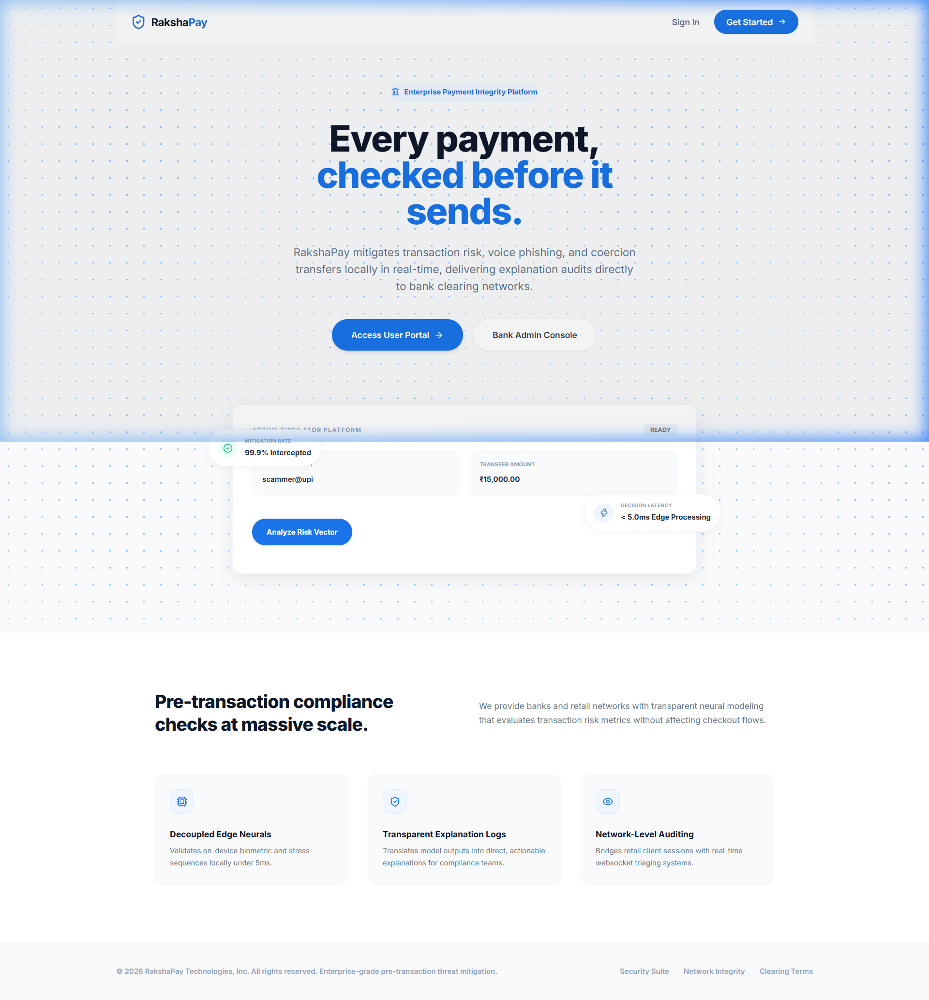

<h1 align="center"> 
  🛡️ RakshaPay
</h1>


<h3 align="center">
  Enterprise-Grade Pre-Transaction UPI Fraud Mitigation & Risk Intelligence Suite
</h3>

<p align="center">
  
  
  
  
  
  
</p>

<hr>

## 🚨 Executive Summary & Threat Landscape

Traditional fraud detection systems in retail payment rails operate **post-transaction**, analyzing transactions retrospectively. This creates lag, making recovery difficult. 

**RakshaPay** is a privacy-preserving pre-transaction risk engine that intercepts suspicious transactions *before* funds leave the user's account. By performing real-time analysis at the edge and bridging client-side metrics with backend telemetry, RakshaPay stops fraud, coercion, and voice phishing scams before settlement occurs.

### Unified Security Vector Scrutiny:
* **Coercion & Behavioral Analytics**: Real-time evaluation of typing velocity anomalies, input copy-paste detection, and abnormal user interaction sequences.
* **On-Device Fingerprinting**: Hashed device identifier swappings and virtual emulator execution flags.
* **Location Velocity Audits**: Geolocation travel coordinates vs velocity limit thresholds.
* **Voice Phishing (Vishing) Mitigation**: Call background frequencies and atypical calling velocities.

---

## 🏗️ System Architecture & Flow

```
User Action: Click Send
          |
          ↓
Behavioral & Device Telemetry Capture
          |
          ↓
 Fast API Gateway Integration
          |
          ↓
  ONNX Risk Engine Model Scoring
          |
          ↓
  Real-Time Decision Logic
       /          |          \
      ↓           ↓           ↓
   [LOW]       [MEDIUM]    [CRITICAL]
  Auto-Pass     Review       Block
 (Settlement)  (Step-Up)    (Flag Alert)
```

### Risk Verdict Guidelines:
* **Low Risk (0 - 29)**: Settlement clears instantly.
* **Medium Risk (30 - 79)**: Transaction paused. Explanation cards prompt the user for step-up verification.
* **Critical Risk (80 - 100)**: Transaction blocked. Real-time alert dispatched to the Admin dashboard via WebSockets.

### Platform Interface Previews

#### 🖥️ 1. Landing Workspace & Risk Sandbox


#### 💳 2. Paytm-Style User Wallet Dashboard


#### 📊 3. Administrative Threat Monitoring Console


---

## ⚡ Technical Stack

* **Frontend**: React 18, Tailwind CSS, Lucide icons, Framer Motion, Recharts charts.
* **Backend Core**: FastAPI, JWT Authentication, WebSockets, Motor (Async MongoDB Driver).
* **ML Inference**: ONNX Runtime, Python Uvicorn microservices.
* **Database**: MongoDB Atlas.

---

## 🛠️ Fail-Safe Presentation Engineering

For evaluation and offline presentation environments, RakshaPay implements two key fail-safe architectures:

### 1. High-Fidelity Sandbox Mode
* **API Resiliency**: The API client (`api.js`) wraps all network fetches in a 20-second timeout. If the database connection times out or the uvicorn backend goes offline, the frontend seamlessly transitions to **Sandbox Fallback Mode**.
* **Zero Downtime**: Logs in and renders complete mock dashboards containing transaction feeds, charts, and administrative registries automatically.

### 2. Silent Pre-Warming Hook
* **Container Sleep Bypass**: Render's free tier spins down containers after 15 minutes of inactivity. To prevent 502/504 errors on user presentations, a background mounting hook in `App.jsx` issues a silent wake-up trigger (`mode: 'no-cors'`) to the production ML URL (`https://sih-ml-service-ibak.onrender.com/docs`) the moment the site opens.
* **Responsive Payments**: The ML service is awake and ready by the time the user logs in and starts a transaction.

---

## 🏃 Local Setup & Run Guide

To boot the entire RakshaPay ecosystem locally, follow these steps:

### 1. Run ML Scoring Service
```bash
cd ml_service
python -m venv venv
# Windows:
.\venv\Scripts\activate
# Unix:
source venv/bin/activate

pip install -r requirements.txt
uvicorn app.main:app --host 0.0.0.0 --port 8001
```

### 2. Run Core Backend Gateway
```bash
cd backend
python -m venv venv
# Windows:
.\venv\Scripts\activate
# Unix:
source venv/bin/activate

pip install -r requirements.txt
uvicorn app.main:app --host 0.0.0.0 --port 8000 --reload
```

### 3. Run Frontend App
```bash
cd frontend
npm install
npm run dev
```
Open [http://localhost:5173/](http://localhost:5173/) to access the portal.

---

## 🚀 Live Deployment & Hosting

| Service | Infrastructure / Tech | Deployment URL |
| :--- | :--- | :--- |
| **Enterprise Web Portal** | Vercel (React + Tailwind) | [raksha-pay-frontend.vercel.app](https://raksha-pay-frontend.vercel.app) |
| **Core Backend Gateway** | Render Web Service (FastAPI) | [sih-irpg.onrender.com](https://sih-irpg.onrender.com) |
| **ML Risk Microservice** | Render API (ONNX Runtime) | [sih-ml-service-ibak.onrender.com](https://sih-ml-service-ibak.onrender.com) |

---

## 🔌 Core API Specifications

| Method | Endpoint | Description |
| :--- | :--- | :--- |
| `POST` | `/api/auth/register` | Create user profile with custom UPI ID |
| `POST` | `/api/auth/login` | Retrieve JWT access and refresh tokens |
| `POST` | `/api/transaction/initiate` | Initiates payment risk evaluation |
| `POST` | `/api/transaction/confirm/{id}` | Confirm paused payment |
| `POST` | `/api/transaction/cancel/{id}` | Cancel paused payment |
| `GET` | `/api/admin/dashboard` | Access aggregate fraud statistics |
| `WS` | `/api/admin/ws/{admin_id}` | Live administrative alert pipeline |

---

## 🔐 Privacy & Security Standards

* **Hashed Fingerprints**: Device identifiers are salted and hashed on the client-side to ensure compliance with banking secrecy codes.
* **Ephemeral Audits**: Behavioral patterns are validated dynamically at the API gateway edge. No raw behavioral data is logged to persistent storage.
* **Role-Based Routing**: Strict JSON Web Token validation isolates administrative tools from public portals.
