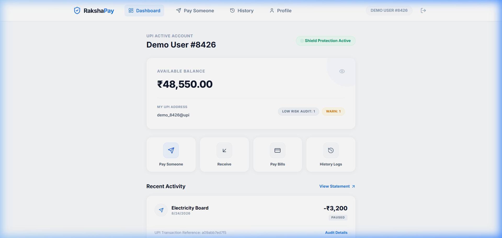
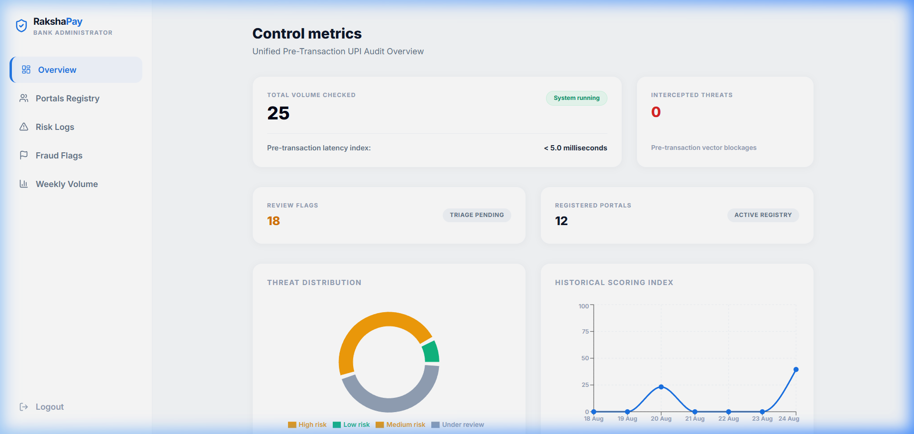

<h1 align="center">
  🛡️ RakshaPay
</h1>

<h3 align="center">
  AI-Powered Real-Time UPI Fraud Prevention & Risk Intelligence Platform
</h3>

  

<h2>🚨 Problem Statement</h2>

Digital payment fraud is rapidly increasing. Existing fraud detection systems mostly analyze transactions after completion, making prevention difficult.

RakshaPay introduces a privacy-preserving AI security layer that predicts fraud risk before a UPI transaction is executed.

<h3>RakshaPay analyses:</h3>

<ul>
<li>Transaction behaviour</li>
<li>Device identity changes</li>
<li>User interaction patterns</li>
<li>Typing behaviour</li>
<li>Location anomalies</li>
<li>Voice phishing indicators</li>
</ul>

<h2>💡 Solution Overview</h2>

RakshaPay works as a real-time transaction interception engine.

<pre>

User Initiates Payment

          |
          ↓

Behaviour & Device Data Collection

          |
          ↓

AI Risk Intelligence Engine

          |
          ↓

Risk Score Generation

          |
          ↓

Decision Engine

       /        |        \

  Approve    Verify    Block

</pre>

<h3>Risk Classification</h3>

<pre>

0 ----------------------------- 100

LOW             MEDIUM          HIGH

0-29            30-79           80+

</pre>

<h2>🏗️ System Architecture</h2>

<table>

<tr>
<th>Component</th>
<th>Purpose</th>
</tr>

<tr>
<td>React Frontend</td>
<td>User and Admin dashboards</td>
</tr>

<tr>
<td>FastAPI Gateway</td>
<td>Authentication, APIs and transaction handling</td>
</tr>

<tr>
<td>ML Microservice</td>
<td>Fraud prediction and behavioural analysis</td>
</tr>

<tr>
<td>ONNX Runtime</td>
<td>High-speed AI inference</td>
</tr>

<tr>
<td>MongoDB Atlas</td>
<td>User, transaction and alert storage</td>
</tr>

<tr>
<td>WebSocket Layer</td>
<td>Real-time fraud notifications</td>
</tr>

</table>

<h2>🤖 AI Risk Intelligence Engine</h2>

RakshaPay uses a hybrid AI scoring architecture combining machine learning inference with behavioural security rules.

<pre>

Raw Behaviour Data

        |
        ↓

Feature Extraction

        |
        ↓

27 Dimensional Feature Vector

        |
        ↓

ONNX Model Inference

        |
        ↓

Risk Probability

        |
        ↓

Transaction Decision

</pre>

<h3>AI Features</h3>

<h4>🖥 Device Intelligence</h4>

<ul>
<li>Device fingerprinting</li>
<li>New device detection</li>
<li>Emulator detection</li>
<li>Device swap analysis</li>
</ul>

<h4>⌨ Behaviour Intelligence</h4>

<ul>
<li>Typing speed analysis</li>
<li>Paste detection</li>
<li>User interaction timing</li>
<li>Navigation behaviour</li>
</ul>

<h4>🌍 Location Intelligence</h4>

<ul>
<li>Location deviation</li>
<li>Travel velocity analysis</li>
<li>Suspicious payment locations</li>
</ul>

<h4>🎙 Voice Fraud Detection</h4>

<ul>
<li>Vishing detection</li>
<li>Social engineering indicators</li>
</ul>

<h2>⚡ Real-Time Decision Engine</h2>

<table>

<tr>
<th>Risk Score</th>
<th>Action</th>
</tr>

<tr>
<td>
<b>0-29</b>
</td>

<td>
✅ Auto approve transaction
</td>

</tr>

<tr>
<td>
<b>30-79</b>
</td>

<td>
⚠ Pause transaction and request confirmation
</td>

</tr>

<tr>
<td>
<b>80-100</b>
</td>

<td>
❌ Block transaction and alert admin
</td>

</tr>

</table>

<h2>📊 Application Screenshots</h2>

<h3>User Dashboard</h3>

<h3>Admin Monitoring Dashboard</h3>

<h2>🚀 Live Deployment</h2>

<table>

<tr>
<th>Service</th>
<th>Technology</th>
<th>Deployment</th>
</tr>

<tr>

<td>
Core Backend Gateway
</td>

<td>
FastAPI
</td>

<td>
<a href="https://sih-irpg.onrender.com">
Live API
</a>
</td>

</tr>

<tr>

<td>
ML Risk Service
</td>

<td>
FastAPI + ONNX Runtime
</td>

<td>
<a href="https://sih-ml-service-ibak.onrender.com">
Live ML API
</a>
</td>

</tr>

</table>

<h2>🔌 API Reference</h2>

<h3>Authentication</h3>

<h4>Register User</h4>

<pre>

POST /api/auth/register

</pre>

<h4>Login</h4>

<pre>

POST /api/auth/login

</pre>

<h3>Transaction Risk Evaluation</h3>

<h4>Initiate Transaction</h4>

<pre>

POST /api/transaction/initiate

</pre>

<pre>

{
 "amount":25000,

 "upi_id":"receiver@upi",

 "behavioral_data":
 {
   "typing_speed":120,
   "is_pasted":false
 },

 "device_data":
 {
   "device_id":"hashed_device",
   "is_emulator":false
 }

}

</pre>

<h4>Response</h4>

<pre>

{

"risk_score":87,

"decision":"BLOCK",

"reason":
"Suspicious device behaviour detected"

}

</pre>

<h2>🔴 Real-Time Admin Alerts</h2>

RakshaPay uses WebSockets for instant security notifications.

<pre>

WSS

/api/admin/ws/{admin_id}

</pre>

Example Alert:

<pre>

Fraud Attempt Detected

User:
Rahul Sharma

Amount:
₹45,000

Risk Score:
92/100

Reason:
New Device + Abnormal Behaviour

</pre>

<h2>🛠️ Tech Stack</h2>

<h3>Frontend</h3>

<ul>
<li>React.js</li>
<li>Tailwind CSS</li>
<li>WebSocket Client</li>
</ul>

<h3>Backend</h3>

<ul>
<li>FastAPI</li>
<li>JWT Authentication</li>
<li>REST APIs</li>
</ul>

<h3>AI/ML</h3>

<ul>
<li>ONNX Runtime</li>
<li>Feature Engineering</li>
<li>Behaviour Modelling</li>
</ul>

<h3>Database</h3>

<ul>
<li>MongoDB Atlas</li>
</ul>

<h2>🏃 Local Setup</h2>

<h3>Clone Repository</h3>

<pre>

git clone https://github.com/shubham-parida01/sih.git

cd sih

</pre>

<h3>Run ML Service</h3>

<pre>

cd ml_service

python -m venv venv

pip install -r requirements.txt

uvicorn app.main:app --port 8001

</pre>

<h3>Run Backend</h3>

<pre>

cd backend

pip install -r requirements.txt

uvicorn app.main:app --port 8000

</pre>

<h2>🔐 Privacy & Security</h2>

<ul>

<li>Privacy-first data processing</li>

<li>Hashed device identities</li>

<li>No raw sensitive behaviour storage</li>

<li>JWT based authentication</li>

<li>Role based access control</li>

</ul>

<h2>🔮 Future Roadmap</h2>

<ul>

<li>Advanced voice fraud detection</li>

<li>Graph based fraud relationship analysis</li>

<li>Federated learning based privacy improvement</li>

<li>Banking API integration</li>

</ul>

<h2 align="center">

🏆 Built for Smart India Hackathon 2026

</h2>

<b>
RakshaPay — Stop Fraud Before Money Moves.
</b>

